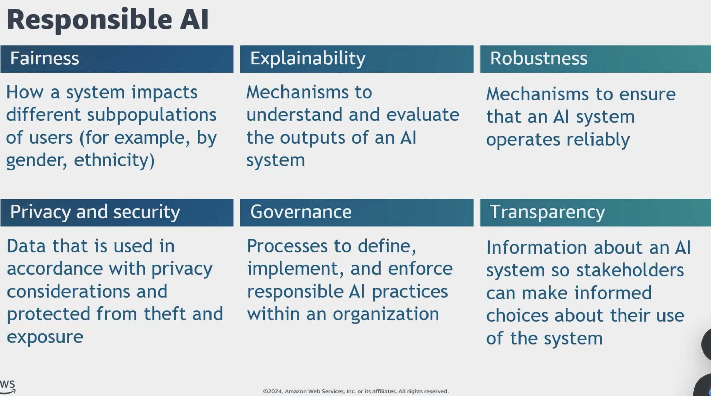
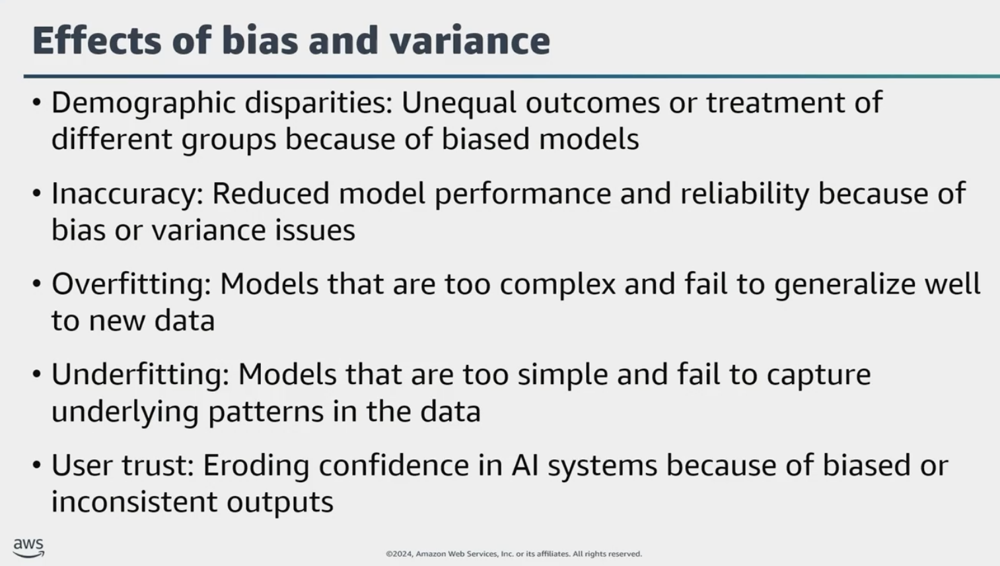
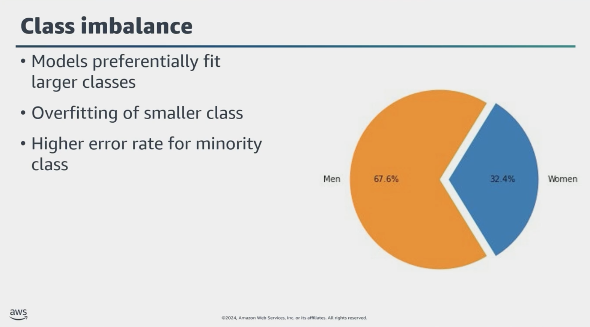
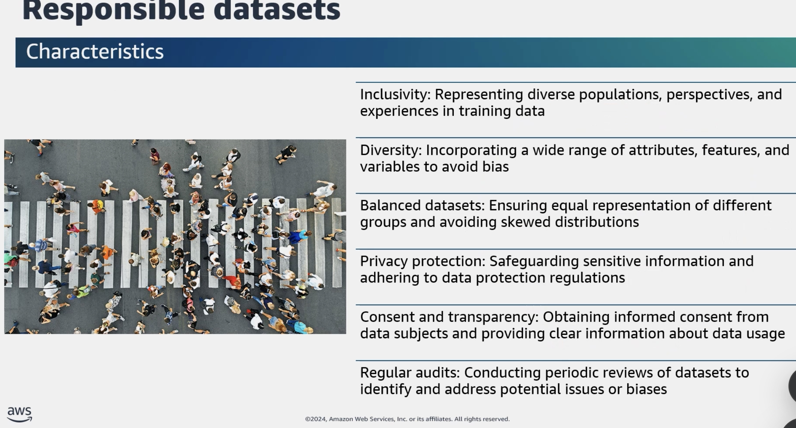
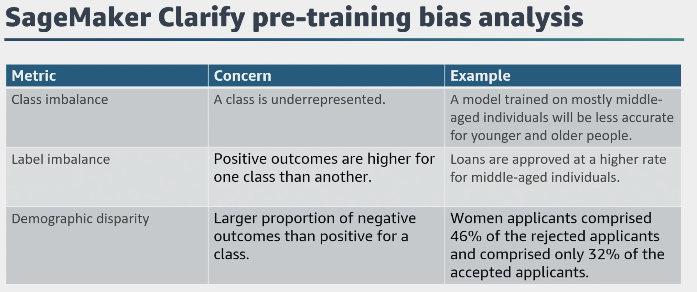

## Understanding Responsible AI (Task 4.1)
- Understand what **Responsible AI** is and its core principles.
- Identify features of responsible AI systems (e.g., fairness, safety, accountability).
- Know tools that support responsible AI practices.
- Learn how responsible AI affects:
  - Model selection
  - Risk assessment
  - Dataset design and characteristics
- Understand **bias and variance** in responsible AI context.
- Use tools to:
  - Detect bias
  - Monitor model behavior
  - Evaluate trustworthiness and truthfulness

# Class Imbalance and Its Impact on Model Performance

## What is Class Imbalance?

Class imbalance occurs when a **feature value has significantly fewer training samples** compared to other values in the dataset.

### Example:
- Feature: **Sex**
  - Women: **32.4%** of training data
  - Men: **67.6%** of training data

This imbalance means the model has seen **more data for men** than for women during training.

## Effects on the Model

- **Better Performance on Majority Class (Men):**
  - More data → more representative patterns learned.
- **Risk of Overfitting the Minority Class (Women):**
  - Fewer samples → model may memorize rather than generalize.
- **Higher Error Rate for Women:**
  - Less exposure → poorer predictions.

## Real-World Consequence

If this model is used to **predict diseases**:
- Women may be **misdiagnosed** more often.
- This could lead to **inequity in healthcare outcomes** and mistrust in the model.

---

> ✅ Addressing class imbalance is essential for **fair, robust, and trustworthy AI**.

## Task 4.2: Transparency and Explainability in AI Models
- Understand why **transparency and explainability** are key challenges in responsible AI.
- Define what makes a model **transparent** or **explainable**.
- Know tools that support explainability (e.g., SHAP, LIME, SageMaker Clarify).
- Evaluate **tradeoffs** between:
  - Model safety/security
  - Model transparency/explainability
- Understand how **human-centric design** supports better explainability in AI systems.

.png>)
